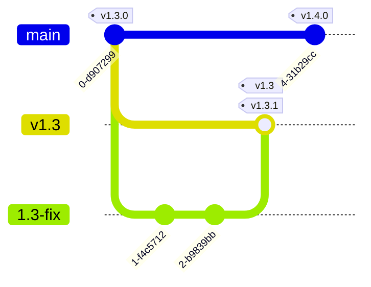
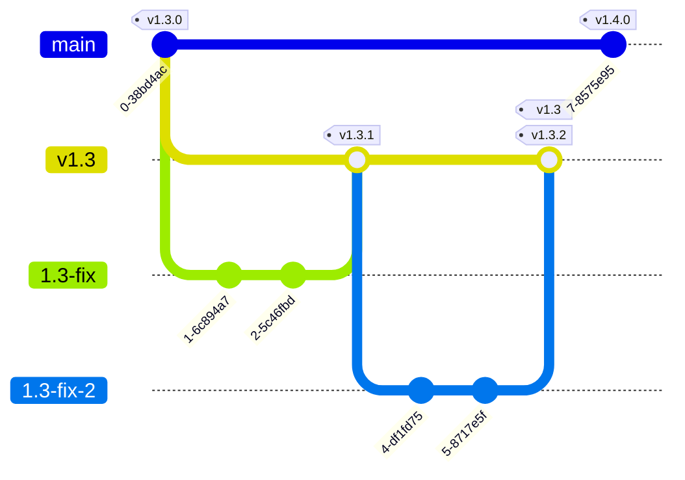

# Small configuration files for GMC Norr

Inspired by [Clinical-Genomics/reference-files](https://github.com/Clinical-Genomics/reference-files).

## nf-core/raredisease

To run the raredisease pipeline in a clinical setting on our cluster, run the following command:

```bash
nextflow \
    run \
    -c $NEXTFLOW_CONFIG_HOME/nf-core/raredisease/raredisease.config \
    -c $NEXTFLOW_CONFIG_HOME/nf-core/rv.config \
    -params-file $NEXTFLOW_CONFIG_HOME/nf-core/raredisease/params.yaml \
    -profile clinical \
    nf-core/raredisease
```

`$NEXTFLOW_CONFIG_HOME` is the path to the `nextflow` directory in a clone of this repo. The `rv` (Region Västerbotten) profile is the general cluster config for nf-core and should be used for all nf-core pipelines. For this config there are also two additional profiles: `clinical` and `research`. These are also general, and will decide what priority the jobs will get on the cluster.

There are three types of analyses that can be run: `wgs` (whole genome), `wes` (whole exome) and `mito` (mitochondrial), and this is set with `--analysis_type`. This will partly decide what software to use and what resources they will need. The default value for this is `wgs`.

A parameter that can be useful in case of failed or otherwise interrupted runs is the `-resume` flag. This will attempt to resume the execution and make use of alredy generated results.

The samplesheet used for the input data is *not* an Illumina samplesheet. See the [nf-core/raredisease documentation](https://nf-co.re/raredisease/2.2.0/docs/usage#samplesheet) for details.

## genomic-medicine-sweden/Twist_Solid

To run Twist Solid in a clinical setting, run the following command:

```bash
snakemake \
    -s $PLUMBER_PIPELINE_HOME/workflow/Snakefile \
    --profile $PLUMBER_PIPELINE_CONFIG/profiles/slurm \
    --configfiles \
        $PLUMBER_PIPELINE_HOME/config/config.yaml \
        $PLUMBER_PIPELINE_HOME/config/config.data.hg19.yaml \
        $PLUMBER_CONFIG_HOME/configs/config.hg19.yaml \
        $PLUMBER_CONFIG_HOME/configs/resources.clinical.yaml \
    --config \
        PROJECT_DESIGN_DATA=$PLUMBER_REFERENCE_DATA \
        PROJECT_PON_DATA=$PLUMBER_REFERENCE_DATA \
        PROJECT_REF_DATA=$PLUMBER_REFERENCE_DATA \
        PLUMBER_PIPELINE_CONFIG=$PLUMBER_PIPELINE_CONFIG \
        PLUMBER_PIPELINE_HOME=$PLUMBER_PIPELINE_HOME \
        PLUMBER_PIPELINE_ASSETS=$PLUMBER_PIPELINE_ASSETS
```

See below for the definition of the different environment variables used. This assumes that the required files `samples.tsv` and `units.tsv` have already been generated and exist in the working directory.

The equivalent command using plumber would be:

```bash
plumber run hydra genomic-medicine-sweden/Twist_Solid --version v0.23.0 --profile slurm_hg19_clinical
```

## Environment variables

These are environment variables that are recommended (and in some cases required):

- `GMCNORR_CONFIG_HOME`: should point to a clone of this repo.
- `NEXTFLOW_CONFIG_HOME`: should point to the `nextflow` directory in this repo.
- `HYDRA_CONFIG_HOME`: should point to the `hydra-genetics` directory in this repo.
- `PLUMBER_PIPELINE_HOME`: should point to local path of the pipeline repo (is set when using plumber).
- `PLUMBER_PIPELINE_CONFIG`: should point to the local path of the pipeline config (is set when using plumber). 
- `PLUMBER_REFERENCE_DATA`: should point to the directory containing all required reference files required for the pipeline.
- `PLUMBER_PIPELINE_ASSETS`: should point to the assets directory of the local pipeline config (is set when using plumber).

## Plumber integration

This repo is configured to work with [plumber](https://github.com/gmc-norr/plumber).
In order to make a pipeline configuration available in plumber, it has to be added to the plumberfile `plumber.yaml`.
See the [plumberfile schema](https://github.com/gmc-norr/plumber/blob/main/schema/plumber-v1.schema.json) for more information.
It is also possible to use plumber to validate the plumberfile.

Due to plumber rearranging the config files to some extent, it needs to be able to control file paths in any config files that refer to files within this repo.
This can be seen in action in the [config for nf-core/raredisease](./nextflow/nf-core/raredisease/raredisease.config).
Since this approach has yet to be extensively tested, it might be subject to change.

To run the same example that is presented at the beginning of this document, run the command:

```bash
plumber nextflow run -p clinical nf-core/raredisease
```

Configs and assets will be downloaded automatically, and the appropriate environment variables will be set.

## Development

### Versioning

This repo uses semantic versioning.
The idea is that the major version represents plumber compatibility, and the minor version represents config changes that are compatible with plumber.
This could be things like adding a configuration for a new pipeline or a new version of a pipeline, or adding capabilities to existing configurations such as new outputs.
Finally, the patch version represents fixes that do not affect pipeline outputs, such as adjusting paths for various resources or adjusting the compute cluster configuration.

### Releases

Releases on the main branch are handled by the release-please Github action, so here no further action needs to be taken.
In cases when an older version needs to be patched, these releases need to be handled manually for now.

If fixes to a minor version need to be applied, a new branch should be created from the initial minor version.
This branch should be named according to the minor version from which it is branched off of.
If we, for example, have version 1.3.0 and want to apply a fix to this, a new branch named `v1.3` should be created.
Fixes can be done either directly on this branch or on a separate branch that is then merged into `v1.3`.
To release the fix, tag the commit according to the patch version in question (`v1.3.1` in this case), but also tag it with `v1.3`, and then create a release from the `v1.3.1` tag.
Whenever new patches are released for the same minor version, the minor version tag should be moved to this commit.

The diagram below shows how the commit history could look for such a change.



The `v1.3` branch is then never merged into the main branch, but continues to live on its own.

If a new fix is added to the `v1.3` branch, the `v1.3` tag is moved to the most recent release.


